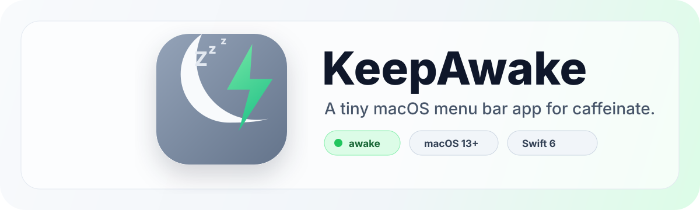

# KeepAwake

<div align="center">



**A tiny macOS menu bar app for keeping your Mac awake when sleep would get in the way.**

[](#requirements)
[](Package.swift)
[](LICENSE)

</div>

KeepAwake wraps macOS' built-in `/usr/bin/caffeinate` command in a focused menu bar interface. Pick the sleep-prevention flags you want, turn KeepAwake on, and let it quietly hold your Mac awake until you turn it off again.

It is useful for long downloads, presentations, builds, file transfers, remote sessions, monitoring dashboards, or any other moment where you want your Mac to stay available without changing permanent system settings.

## Preview

<p align="center">
  
</p>

## Features

- Lives in the macOS menu bar with no Dock icon.
- Starts and stops a background `caffeinate` process.
- Lets you choose the exact `caffeinate` flags before starting.
- Locks selected flags while running so the active process stays predictable.
- Shows current status and active flags at a glance.
- Can open automatically at login using macOS Login Items.
- Uses only local macOS system APIs; no network service or account required.

## Requirements

- macOS 13 or newer
- Xcode or the Swift toolchain for building from source
- XcodeGen if you want to regenerate the Xcode project from `project.yml`

## Quick Start

Clone the repo and build the app bundle:

```bash
git clone https://github.com/murilloarturo/keepawake.git
cd keepawake
./scripts/build_app.sh
open dist/KeepAwake.app
```

The app appears in the menu bar. Look for the moon/bolt icon.

## Usage

1. Open KeepAwake from the menu bar.
2. Select the sleep-prevention options you want.
3. Click **Turn KeepAwake On**.
4. Leave it running while your task finishes.
5. Click **Turn KeepAwake Off** when your Mac can sleep normally again.

To launch KeepAwake automatically after signing in, enable **Open at Login** in the app. If macOS asks for approval, KeepAwake will show a shortcut to **System Settings > General > Login Items & Extensions**.

## Caffeinate Flags

KeepAwake exposes the common `caffeinate` flags directly:

| Flag | Option | What it does |
| --- | --- | --- |
| `-d` | Prevent display sleep | Keeps the screen awake. |
| `-i` | Prevent idle sleep | Stops idle sleep while active. |
| `-m` | Prevent disk sleep | Avoids disk sleep. |
| `-s` | Prevent system sleep | Keeps the system awake while on AC power. |
| `-u` | Declare user activity | Tells macOS the user is active. |

If no flags are selected, `caffeinate` still runs with its default behavior.

## Development

Run tests:

```bash
swift test
```

Build the distributable app bundle:

```bash
./scripts/build_app.sh
open dist/KeepAwake.app
```

Open the Xcode project:

```bash
open KeepAwake.xcodeproj
```

Regenerate the Xcode project from `project.yml`:

```bash
xcodegen generate
```

## Project Structure

```text
Sources/KeepAwake/        SwiftUI menu bar app
Tests/KeepAwakeTests/     Swift package tests
Resources/Info.plist      App bundle metadata
scripts/build_app.sh      Release build and app bundle script
project.yml               XcodeGen project definition
dist/                     Built app bundle
```

## Contributing

Issues and pull requests are welcome. Keep changes small, focused, and easy to test. For UI changes, include a short note describing the user-facing behavior.

## License

KeepAwake is available under the [MIT License](LICENSE).
