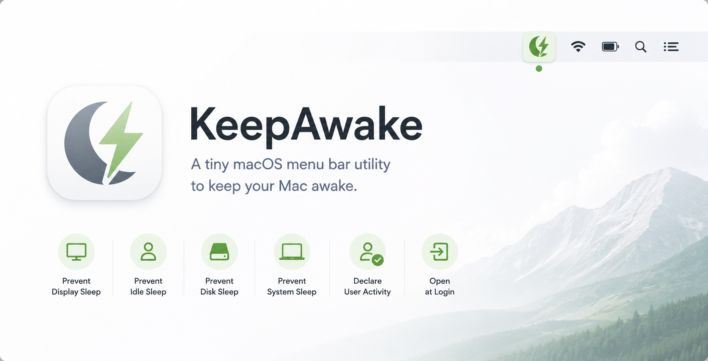
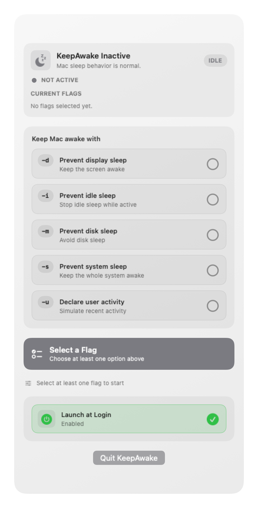

# KeepAwake

<div align="center">

[](#supported-runtime-environments)
[](Package.swift)
[](LICENSE)
[](#why-keepawake)

<br/>



**A tiny macOS menu bar app for keeping your Mac awake when sleep would get in the way.**

</div>

KeepAwake is a focused macOS wrapper around the built-in `/usr/bin/caffeinate` command. It gives you a clean menu bar interface for choosing exactly how your Mac should stay awake, then starts and stops `caffeinate` for you.

<!-- keepawake readme beginning -->

## What is KeepAwake?

KeepAwake is a native SwiftUI menu bar app for temporary sleep prevention. It has two practical modes of use:

**Keep the Mac running:** For long-running tasks such as builds, downloads, file transfers, scripts, backups, model training, or remote sessions. You can prevent idle sleep, disk sleep, or system sleep without changing permanent macOS power settings.

**Keep the display available:** For presentations, dashboards, demos, video calls, monitoring screens, and other work where the screen should remain visible. You can prevent display sleep or declare user activity through the same menu.

When KeepAwake is off, your Mac returns to its normal sleep behavior.

## Preview

<p align="center">
  
</p>

## Supported runtime environments

KeepAwake is intentionally small and macOS-only.

| Runtime environment | Method | Controls |
| --- | --- | --- |
| macOS 13 or newer<sup>[1]</sup> | `/usr/bin/caffeinate` | Display sleep, idle sleep, disk sleep, system sleep, user activity |
| macOS Login Items | `SMAppService.mainApp` | Optional Launch at Login setting |

## Installing

Clone the repository and build the app bundle:

```bash
git clone https://github.com/murilloarturo/keepawake.git
cd keepawake
./scripts/build_app.sh
open dist/KeepAwake.app
```

The app appears in the macOS menu bar. Look for the moon/bolt icon.

> [!NOTE]
> KeepAwake currently builds locally from source. If macOS warns that the app is from an unidentified developer, that is expected for a local unsigned build.

## Why KeepAwake?

<dl>
  <dt>Non-disruptive</dt>
  <dd>KeepAwake uses macOS' own <code>caffeinate</code> command. It does not wiggle the mouse, press fake keys, or fight the system with background tricks.</dd>

  <dt>Easy to stop</dt>
  <dd>Turning KeepAwake off terminates the background <code>caffeinate</code> process. Your normal sleep settings take over again.</dd>

  <dt>Precise control</dt>
  <dd>Choose only the flags you need: display, idle, disk, system, or user activity. The selected flags are locked while the process is running so the active behavior is predictable.</dd>

  <dt>Menu bar native</dt>
  <dd>The app stays out of the Dock and lives where a utility should: in the menu bar.</dd>

  <dt>Launch at Login</dt>
  <dd>KeepAwake can register itself with macOS Login Items so it is ready after you sign in.</dd>

  <dt>No account, no network</dt>
  <dd>KeepAwake runs locally and does not require a web service, login, telemetry, or network access.</dd>

  <dt>Permissive license</dt>
  <dd>The project is available under the MIT License.</dd>
</dl>

## App usage

1. Open KeepAwake from the menu bar.
2. Select at least one sleep-prevention option.
3. Click **Turn KeepAwake On**.
4. Leave it running while your task finishes.
5. Click **Turn KeepAwake Off** when your Mac can sleep normally again.

To launch KeepAwake automatically after signing in, enable **Launch at Login** in the app. If macOS asks for approval, KeepAwake will show a shortcut to **System Settings > General > Login Items & Extensions**.

## Caffeinate flags

KeepAwake exposes the common `caffeinate` flags directly:

| Flag | Option | What it does |
| --- | --- | --- |
| `-d` | Prevent display sleep | Keeps the screen awake. |
| `-i` | Prevent idle sleep | Stops idle sleep while active. |
| `-m` | Prevent disk sleep | Avoids disk sleep. |
| `-s` | Prevent system sleep | Keeps the system awake while on AC power. |
| `-u` | Declare user activity | Tells macOS the user is active. |

KeepAwake requires at least one flag before the start button is enabled.

## Command line equivalent

KeepAwake is a graphical front end for commands like this:

```bash
caffeinate -d -i -m -s -u
```

Use the app when you want to toggle these behaviors quickly from the menu bar, see which flags are active, and keep the setup ready at login.

## Where KeepAwake is useful

**Long-running work**
- Xcode builds
- Package installs
- Data processing scripts
- Model training or local automation

**Transfers and downloads**
- Large file downloads
- Backups
- External drive operations
- Cloud sync catch-up

**Presentations and monitoring**
- Demos
- Dashboards
- Video calls
- Status screens

**Remote access**
- SSH sessions
- Screen sharing
- Remote maintenance
- Keeping a Mac reachable while a task completes

## Development

Run tests:

```bash
swift test
```

Build the distributable app bundle:

```bash
./scripts/build_app.sh
open dist/KeepAwake.app
```

Open the Xcode project:

```bash
open KeepAwake.xcodeproj
```

Regenerate the Xcode project from `project.yml`:

```bash
xcodegen generate
```

## Project structure

```text
Sources/KeepAwake/        SwiftUI menu bar app
Tests/KeepAwakeTests/     Swift package tests
Resources/Info.plist      App bundle metadata
scripts/build_app.sh      Release build and app bundle script
project.yml               XcodeGen project definition
dist/                     Built app bundle
```

## Links

- GitHub: [github.com/murilloarturo/keepawake](https://github.com/murilloarturo/keepawake)
- Issues: [github.com/murilloarturo/keepawake/issues](https://github.com/murilloarturo/keepawake/issues)
- License: [MIT License](LICENSE)

## Roadmap ideas

These are natural next steps for the app:

| Area | Idea |
| --- | --- |
| Distribution | Signed release builds or a downloadable DMG |
| App identity | Native app icon and improved README/banner artwork |
| Control | Optional timer or auto-stop duration |
| Presets | Saved flag combinations for common workflows |
| Visibility | Show active flags directly in the menu bar title |
| Automation | Apple Shortcuts or command-line hooks |

## Contributing

Issues and pull requests are welcome. Keep changes small, focused, and easy to test. For UI changes, include a short note describing the user-facing behavior.

## License

The contents of this repository are available under the [MIT License](LICENSE), which is permissive and allows you to use, modify, distribute, and include the code in commercial or non-commercial projects.

---------------

## Footnotes

| | |
| --- | --- |
| <sup>[1]</sup> | KeepAwake targets macOS 13 or newer because it uses SwiftUI menu bar APIs and the modern ServiceManagement login item API. |
